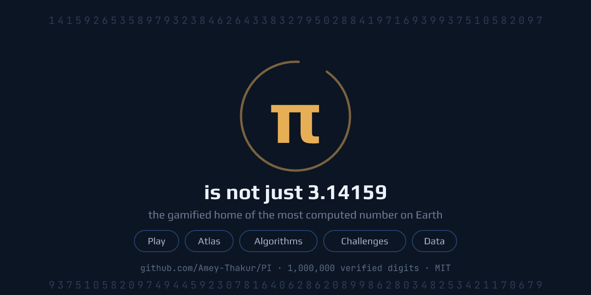

<!--
  Name: README.md
  Purpose: The front door of the repository.
  Description: States what this project is in the first screen, then routes
    five kinds of visitors (players, readers, programmers, self-testers,
    verifiers) to the wing built for them. Everything claimed here is
    verifiable inside the repository itself.
  License: MIT
  Author: Amey Thakur (https://github.com/Amey-Thakur)
  Date: 2026-07-18
-->

<div align="center">

# π

**π is not just 3.141592653589793.**

It is 4,000 years of human effort, an unproven mystery, and the most computed
number on Earth. This repository is a complete home for it: a game you can
play, an atlas you can read, algorithms you can run, and a million digits you
can trust.

**[Play the site](https://amey-thakur.github.io/PI/)** ·
[See the digits](DIGITS.md) ·
[Read the atlas](atlas/README.md) ·
[Run the algorithms](algorithms/README.md) ·
[Climb the challenges](challenges/README.md)

<br>

[](LICENSE)
[](DIGITS.md)
[](https://github.com/Amey-Thakur/PI)
[](https://github.com/Amey-Thakur)

<br>



</div>

---

<br>

## Start here

Five wings, one subject. Pick the door that matches why you came.

| If you want to | Go to | What is there |
| :--- | :--- | :--- |
| **Play** with π | [The site](https://amey-thakur.github.io/PI/) | 8 interactive labs, 8 badges, a history quiz |
| **Read** about π | [`atlas/`](atlas/README.md) | 10 chapters and a glossary, written to be read |
| **Run** π | [`algorithms/`](algorithms/README.md) | 22 implementations, 3 languages, no dependencies |
| **Test** yourself | [`challenges/`](challenges/README.md) | 25 challenges across 4 tiers |
| **Verify** π | [`data/`](data/README.md) | 1,000,000 decimals, double-computed |

> [!NOTE]
> No accounts, no servers, no trackers, no external requests. Every byte the
> site needs is in this repository, so once the page has loaded it works
> offline, on a plane, forever.

<br>

---

<br>

## The site

**[amey-thakur.github.io/PI](https://amey-thakur.github.io/PI/)** is a single
page. Eight labs turn π into something you operate rather than read about, and
each one is wired to a badge with a threshold you have to actually reach.

| Lab | What happens | Badge | Earned by |
| :--- | :--- | :--- | :--- |
| Digit Trainer | Recite π from memory, three misses and you are out | First Digits | 10 decimals |
| Digit Trainer | | Memory of Pi | 25 decimals |
| Digit Search | Find your birthday inside a million decimals | Digit Hunter | any number found |
| Monte Carlo | Watch random darts converge on π | Estimator | 10,000 darts |
| Buffon's Needle | The 1777 experiment, live on a lined floor | Needle Dropper | 1,000 needles |
| Digit Walk | The decimals steer a walker across the canvas | Wanderer | 5,000 steps |
| Digit Spiral | Ten thousand digits wound into colored rings | | |
| Pi Melody | The digits played on a pentatonic scale | Composer | 32 notes |
| Digit Census | Frequency of 0 to 9, tested with chi-square | | |

Alongside the labs sit a **history quiz** of five questions spanning 4,000
years, which earns the **Historian** badge for a clean sweep, and a timeline,
a records ladder, and a formula gallery.

<br>

---

<br>

## The atlas

Ten chapters in [`atlas/`](atlas/README.md), written to be read rather than
skimmed, from the definition of π to what nobody has managed to prove about it.

| # | Chapter | What it covers |
| :-: | :--- | :--- |
| 1 | [What is pi](atlas/01-what-is-pi.md) | π from the circle, connected to area and to radians |
| 2 | [Four thousand years of history](atlas/02-history.md) | The chase in five eras, from rope and clay to silicon |
| 3 | [The formula collection](atlas/03-formulas.md) | Ten families, from circle geometry to Chudnovsky |
| 4 | [How pi gets computed](atlas/04-algorithms.md) | The engineering chapter: what each method family costs |
| 5 | [The digits themselves](atlas/05-digits.md) | Normality defined precisely, with this repository's own chi-square table |
| 6 | [Records](atlas/06-records.md) | ENIAC in 1949 through to 314 trillion |
| 7 | [What nobody knows](atlas/07-open-problems.md) | What is known, separated from what is only believed |
| 8 | [Pi in the physical world](atlas/08-pi-in-science.md) | Why π appears where no circle is visible: symmetry and Gaussians |
| 9 | [Pi in culture](atlas/09-culture.md) | Pi Day and its cousins, piphilology, π in law and film |
| 10 | [Further reading](atlas/10-reading.md) | The originals, pointed at rather than distilled |

> [!TIP]
> A [glossary](atlas/glossary.md) defines every technical term the repository
> uses, so no page assumes what another page teaches. If a word in any chapter
> is unfamiliar, it is defined there.

<br>

---

<br>

## The algorithms

Twenty two working implementations in [`algorithms/`](algorithms/README.md),
from Archimedes' polygons to the Chudnovsky series that holds every modern
record. Standard library only, one algorithm per file, every file runnable in
seconds.

| Language | Files | Why it is here |
| :--- | --: | :--- |
| [Python](algorithms/python/) | 14 | Arbitrary precision built in, so the fast series are readable |
| [JavaScript](algorithms/javascript/) | 5 | Runs in the same browser the site does |
| [Rust](algorithms/rust/) | 3 | Shows what the same mathematics costs when speed is the point |

```
py   algorithms/python/chudnovsky.py
node algorithms/javascript/machin.js
```

The point of keeping them side by side is that they fail differently. Monte
Carlo is the easiest to explain and the worst to use: error falls with the
square root of the sample count, so a hundred times the work buys one more
digit. Chudnovsky is nearly unreadable by comparison and adds roughly fourteen
digits per term. Running both is what turns that gap from an assertion into
something you have watched happen.

<br>

---

<br>

## The challenges

Twenty five challenges in [`challenges/`](challenges/README.md), from
memorizing ten digits to computing a million and verifying them yourself.

| Tier | For | Ends at |
| :--- | :--- | :--- |
| **Novice** | First contact | Reciting and finding digits |
| **Apprentice** | Some mathematics | Estimating π by experiment |
| **Expert** | Comfortable programming | Implementing the classical series |
| **Master** | Prepared to wait | A million digits, independently verified |

Hints and solutions are sealed in folding sections, so nothing is spoiled
before you have tried it.

<br>

---

<br>

## The data

[`data/`](data/README.md) holds 1,000, 10,000, 100,000, and 1,000,000 verified
decimals of π.

> [!IMPORTANT]
> **Verified means exactly this, and nothing looser.**
>
> 1. Generated by the Chudnovsky series with binary splitting
>    ([`scripts/generate_digits.py`](scripts/generate_digits.py)).
> 2. Recomputed from scratch by the unrelated Gauss-Legendre iteration on a
>    different arithmetic engine
>    ([`scripts/verify_digits.py`](scripts/verify_digits.py)).
> 3. Published only because both computations agree on every single digit.
>
> Two independent methods, two engines, full agreement. That is the standard
> world record computations use, applied at repository scale, and two commands
> reproduce all of it on your own machine.

<br>

---

<br>

## Questions people ask

<details>
<summary><b>How many digits does anyone actually need?</b></summary>

<br>

NASA JPL steers interplanetary spacecraft with 15 decimals. About 37 digits
would size the observable universe to within the width of a hydrogen atom.
Everything past that is sport, benchmarking, and mathematics, which is a
perfectly good reason to continue. See [Records](atlas/06-records.md).

</details>

<details>
<summary><b>Is my birthday in π?</b></summary>

<br>

Almost certainly, and the [site](https://amey-thakur.github.io/PI/) will find
it. Any four digit string tends to appear within the first ten thousand
decimals or so. Note the careful word: *almost*. Nobody has proved every
string must appear, which is the next question.

</details>

<details>
<summary><b>Are the digits random?</b></summary>

<br>

They pass every statistical test thrown at them, and this repository runs one
of those tests on its own million digits. Yet nobody has proved they must.
That gap between overwhelming evidence and proof is one of the great open
problems: see [What nobody knows](atlas/07-open-problems.md).

</details>

<details>
<summary><b>What is the record?</b></summary>

<br>

314 trillion digits, as of mid 2026. The full ladder, from clay tablets to
cloud clusters, is in [History](atlas/02-history.md) and
[Records](atlas/06-records.md).

</details>

<br>

---

<br>

## Contributing

Corrections, new algorithm implementations, and new challenges are welcome.
[CONTRIBUTING.md](CONTRIBUTING.md) explains the bar: every claim and every
digit here is verifiable, and contributions hold the same standard.

## License

[MIT](LICENSE). Use anything here for anything, with attribution.

## Colophon

Even the colors are π. In hexadecimal, π is 3.243F6A88..., and reading those
fractional digits as a color gives `#243F6A`, the deep blue the site's dark
theme is built on. The gold accent is that blue's exact complement, and light
mode is pastry cream, for the pie. Nothing here is decoration for its own
sake; if a detail did not earn its place, it is not in this repository.

<br>

---

<div align="center">

**[Site](https://amey-thakur.github.io/PI/) ·
[Digits](DIGITS.md) ·
[Atlas](atlas/README.md) ·
[Algorithms](algorithms/README.md) ·
[Challenges](challenges/README.md) ·
[Data](data/README.md)**

`3.14159 26535 89793 23846 26433 83279 50288 41971 69399 37510 ...`

Celebrated on March 14 and July 22. Read all year.

Built and maintained by [Amey Thakur](https://github.com/Amey-Thakur) ·
[MIT](LICENSE) · corrections welcome through
[CONTRIBUTING.md](CONTRIBUTING.md)

</div>
